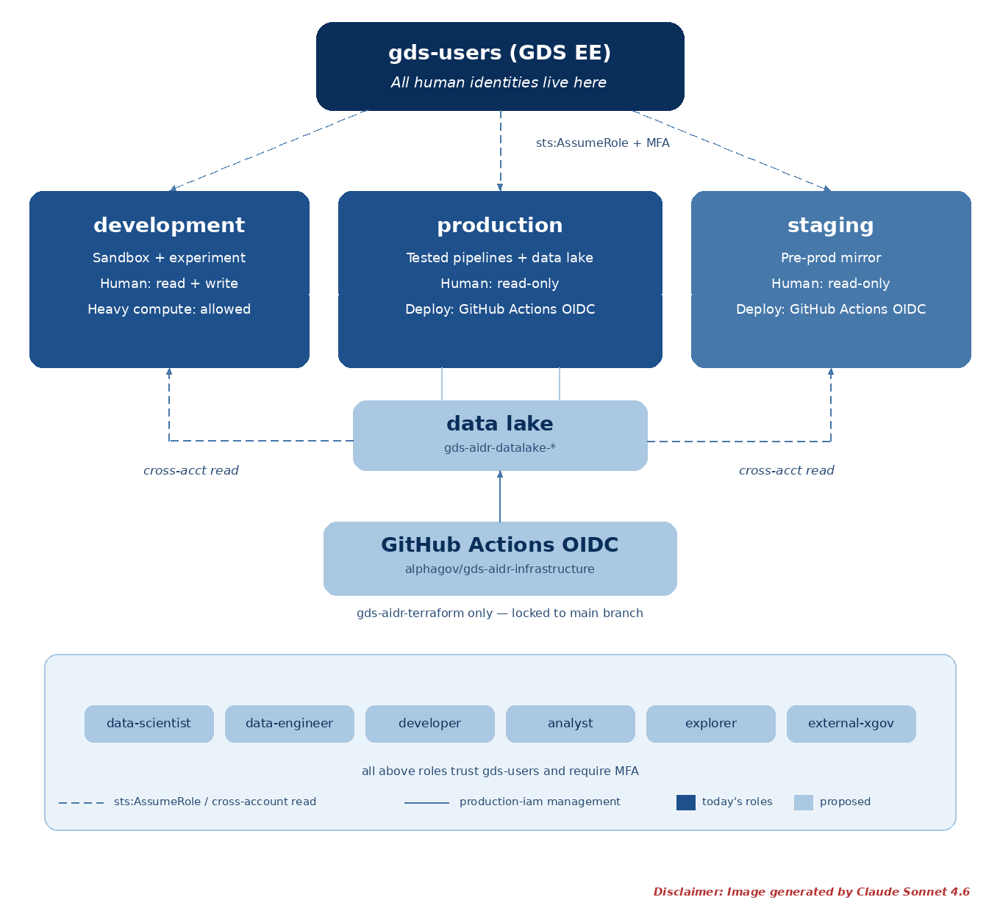

# GDS AIDR Infrastructure Repository

<!--date_created: mon-18-may-2026-->
<!--date_updated: thurs-16-july-2026-->


**Index**
 - [Repository structure](#repository-structure)
 - [Architecture diagrams](#architecture-diagrams)
    - [Data lake](#data-lake)
 - [Get access](#get-access)
    - [For developers and platform admins](#for-developers-and-platform-admins)
    - [Console access - all users](#console-access)
 - [Accessing Claude Code in Bedrock](#accessing-claude-code-in-bedrock)
 - [Monitoring and auditing](#monitoring-and-auditing)
 - [Contributing](#contributing)

> **Note:** to avoid confusion we will not use short forms of any of the environment names. Development and Production will be referred to as that in any code, variables, policies and documents, not *Dev* or *Prod*

This is a **public repository**

> **Note to developers:** 
> 1. Commit messages follow either the [Conventional Commits](https://www.conventionalcommits.org/en/v1.0.0/#specification) or [Angular Commit](https://github.com/angular/angular/blob/main/contributing-docs/commit-message-guidelines.md) specification. Use one commit per logical change — a commit can include multiple file edits, but they must all relate to the same underlying change.
> 2. All branches must follow the same pattern as commit messages, ie `topic(sub-topic): < your-commit-msg-here >`
> 3. We use [Semantic Versioning](https://semver.org/) for releases
> 4. All changes must be submitted by PR. No direct merges to main

---
## Repository Structure
*[(back)](#gds-data-innovation-and-ai-readiness-team-cloud-infrastructure-repository)*

```zsh
.gds-aidr-infrastructure
├── .editorconfig
├── .eslintrc
├── .github
│   ├── CODEOWNERS
│   ├── ISSUE_TEMPLATE
│   │   ├── bug_report.md
│   │   └── feature_request.md
│   └── workflows
├── .gitignore
├── .prettierrc
├── CONTRIBUTING.md
├── LICENSE
├── README.md
├── claude_code_bedrock_guide.md
├── docs
│   ├── _static
│   ├── architecture
│   │   ├── overview.md
│   └── infrastructure
│   │   ├── system-overview.md
│   │   ├── networking.md
│   │   ├── compute.md
│   │   ├── data-lake.md
│   │   └── iam-cross-account-strategy.md
├── infrastructure
│   └── terraform
│       ├── bootstrap
│       │   ├── trust-policy-development.json
│       │   └── trust-policy-staging.json
│       ├── environments
│       │   ├── production-iam
│       │   ├── networking
│       │   ├── containers
│       │   ├── compute
│       │   ├── data-lake
│       │   └── monitoring
│       └── modules
│           ├── budget-alerts
│           ├── cloudtrail-digest
│           ├── iam-centralised
│           ├── vpc
│           ├── ecr
│           ├── s3-bucket
│           ├── data-lake
│           ├── workload-iam
│           ├── ecs-cluster
│           └── ecs-fargate-service
├── package.json
├── role_scopes.pdf
└── tree.txt
```

---

## Architecture diagrams
*[(back)](#gds-data-innovation-and-ai-readiness-team-cloud-infrastructure-repository)*

Plain-English diagrams showing how the platform fits together, written as Mermaid diagram-as-code — free, open source, and rendered automatically by GitHub with no external service or paid plan required. See `docs/architecture/`:

- [`system-overview.md`](docs/infrastructure/system-overview.md) — the whole platform in one picture
- [`networking.md`](docs/infrastructure/networking.md) — how each account's private network is laid out
- [`compute.md`](docs/infrastructure/compute.md) — how a running service gets its permissions
- [`data-lake.md`](docs/infrastructure/data-lake.md) — where synthetic data is stored and governed

---

## Data lake


## Mermaid Diagram (data-lake)

```(mermaid)
flowchart LR
  subgraph development ["Development"]
    dcom["Compute"]
  end

  subgraph staging ["Staging"]
    scom["Compute"]
  end

  subgraph production ["Production"]
    pdl["Data Lake S3 Bucket"]
    kms["KMS Encryption Key"]
    lf["Lake Formation"]
    trail["CloudTrail"]
    logs["CloudWatch Logs"]
  end

  dcom -->|reads and writes generated data| pdl
  scom -->|reads authoritative data| pdl

  lf -->|governs access controls| pdl
  pdl -->|encrypted at rest by| kms
  
  pdl -->|logs object-level API activity| trail
  trail -->|delivers audit logs| logs
```

### Infrastructure Components

* **Storage:** A single Amazon S3 bucket for datasets and metadata, separated by logical prefixes.
* **Security:** All public access is explicitly blocked at the bucket level. Data is encrypted at rest using a customer-managed AWS KMS key.
* **Auditing:** Object-level API activity (read and write) is logged via an associated AWS CloudTrail trail directly to Amazon CloudWatch Logs.
* **Governance:** IAM roles and policies are provisioned to allow AWS Lake Formation to register and govern the S3 locations securely.

### Usage

.. code-block:: terraform

```
module "data_lake" {
  source = "../../modules/data-lake"

  bucket_name           = "gds-aidr-data-lake-production"
  production_account_id = "<PRODUCTION_ACCOUNT_ID>"
  role_prefix           = "gds-aidr"

  reader_account_arns = [
    "arn:aws:iam::<DEVELOPMENT_ACCOUNT_ID>:root", # Development account root
    "arn:aws:iam::<STAGING_ACCOUNT_ID>2:root"  # Staging account root
  ]

  tags = {
    Environment = "Production"
    Owner       = "gds-aidr-team"
  }
}

```

### Inputs

* `bucket_name` (string, required): Name of the data lake bucket.
* `production_account_id` (string, required): AWS account ID of the Production account that owns and administers the encryption key.
* `dataset_prefix` (string, optional): Prefix for dataset files. Default is `datasets/email/v1/`.
* `metadata_prefix` (string, optional): Prefix for metadata files. Default is `metadata/email/v1/`.
* `reader_account_arns` (list(string), optional): Account root ARNs permitted to read the lake cross-account, such as the Development and Staging account roots. Default is `[]`.
* `lakeformation_register_role_arn` (string, optional): ARN of an existing role Lake Formation uses to access the registered metadata location. Used when `create_lakeformation_register_role` is false.
* `create_lakeformation_register_role` (bool, optional): Whether this module creates the Lake Formation registration role itself. Default is `true`.
* `role_prefix` (string, optional): Prefix for IAM role names created by this module. Default is `gds-aidr`.
* `audit_log_retention_days` (number, optional): Retention period in days for object-level audit logs. Default is `365`.
* `tags` (map(string), optional): Tags applied to all resources created by the module.

### Outputs

* `bucket_name`: Name of the data lake bucket. Consumed by the data backend repository.
* `bucket_arn`: ARN of the data lake bucket.
* `kms_key_arn`: ARN of the customer-managed AWS KMS encryption key.
* `dataset_prefix`: Prefix used for dataset files.
* `metadata_prefix`: Prefix used for metadata files.
* `audit_log_group`: Name of the Amazon CloudWatch log group containing object-level S3 audit logs.
* `lakeformation_register_role_arn`: ARN of the Lake Formation registration role.


---

## Get access

**Some mandatory disclaimers**
* All users, with the exception of developer/engineer and admin users have access to the AIDR development environment.
* Developer/engineers and platform admins have access to all three environments. 
* Usage is tagged and tracked to ensure we can keep on top of resource use and spend per individual
* You will not have any rights to create iam roles on any account.
* Only `eu-west-2` region is permitted **by default**, without exception for anyone on the platform, including developer/engineer/platform admins. 

### Role mappings per environment

> IAM roles are maintained **centrally**, ie one place 

```
gds-users
├── GDS AIDR Development Acct (gds-aidr-development)
│   ├── gds-aidr-admin               ← admins only (named ARNs + MFA)
│   ├── gds-aidr-terraform           ← human + GitHub OIDC
│   ├── gds-aidr-data-scientist      ← PowerUserAccess, heavy compute allowed
│   ├── gds-aidr-developer           ← PowerUserAccess, heavy compute denied
│   ├── gds-aidr-analyst             ← ReadOnlyAccess, heavy compute denied
│   ├── gds-aidr-explorer            ← ReadOnlyAccess, heavy compute denied
│   ├── gds-aidr-readonly
│   ├── gds-aidr-security-audit
│   └── GitHub OIDC provider
├── GDS AIDR Staging Acct (gds-aidr-staging)
│   ├── gds-aidr-terraform
│   ├── gds-aidr-data-scientist      ← ReadOnlyAccess, heavy compute denied
│   ├── gds-aidr-developer           ← ReadOnlyAccess, heavy compute denied
│   ├── gds-aidr-analyst             ← ReadOnlyAccess, heavy compute denied
│   ├── gds-aidr-explorer            ← ReadOnlyAccess, heavy compute denied
│   ├── gds-aidr-readonly
│   ├── gds-aidr-security-audit
│   └── GitHub OIDC provider
└── GDS AIDR Production Acct (gds-aidr-production) 
    ├── gds-aidr-admin               ← admins only (named ARNs + MFA)
    ├── gds-aidr-terraform
    ├── gds-aidr-data-scientist      ← ReadOnlyAccess, heavy compute denied
    ├── gds-aidr-developer           ← ReadOnlyAccess, heavy compute denied
    ├── gds-aidr-analyst             ← ReadOnlyAccess, heavy compute denied
    ├── gds-aidr-explorer            ← ReadOnlyAccess, heavy compute denied
    ├── gds-aidr-readonly
    ├── gds-aidr-security-audit
    └── GitHub OIDC provider
```

See also **[`role_scopes`](./role_scopes.pdf)**

### Access the AIDR platform

0. If you are not currently a user on `gds-users` you will not be able to access the AIDR accounts

    **Request an AWS account from `gds-users`**
    
    **[https://engineering-enablement.gds-reliability.engineering/engineering/aws/users.html#requesting-a-new-aws-user](https://engineering-enablement.gds-reliability.engineering/engineering/aws/users.html#requesting-a-new-aws-user)**

> This is handled by another team in GDS/DSIT, you can contact engineering enablement on slack. The link above also has contact/escalation information. AIDR team cannot assist with this step. If you have issues with dsit email, contact EE team.


### Setup AWS CLI

> You must have MFA setup to use AWS. Once you have a `gds-users` user account on the organisation root:

1. [Login to AWS Console `eu-west-2`](https://eu-west-2.signin.aws.amazon.com/oauth?response_type=code&client_id=arn%3Aaws%3Asignin%3A%3A%3Aconsole%2Fcanvas&redirect_uri=https%3A%2F%2Feu-west-2.console.aws.amazon.com%2Fconsole%2Fhome%3Fca-oauth-flow-id%3D2e22%26hashArgs%3D%2523%26isauthcode%3Dtrue%26region%3Deu-west-2%26state%3DhashArgsFromTB_eu-west-2_6074d4ffbdeee16b&forceMobileLayout=0&forceMobileApp=0&code_challenge=sMKSP6mpJF8GyuCYUITXDoM1akiBy3asMJqP2U7AYpw&code_challenge_method=SHA-256)
2. Navigate to the top RHS: username -> Security Credentials
3. Setup MFA.
4. Make a note of these when you set up MFA and store in a safe place. You will need this to access AWS CLI: 
   
   - MFA_SERIAL/ARN
   - AWS_ACCESS_KEY_ID
   - AWS_SECRET_ACCESS_KEY

5. Log in and out for changes to take effect. You should need to provide your MFA this time. 
    
> AWS accounts within AIDR team are assumed via the alphagov `gds-users` organisation/root account


### Assume role

0. You will be given a ROLE_ARN by the platform admin. Keep this in a safe place. 

> The following guidance assumes you have access to VSCODE

1. Install [`awscli`](https://docs.aws.amazon.com/cli/latest/userguide/getting-started-install.html)

2. Configure your AWS profile(s)

> It is quite common to have more than one AWS profile for each role you are assuming

3. Your profile in `.config` will look like this; one corresponds to the ROOT `gds-users` account which you assume role into the AIDR platform, and the other corresponds to your role

```~.aws/~.config
# required by everyone
[profile gds-users]
region=eu-west-2
output=json
mfa_serial=<MFA_SERIAL>

# your specific profile
[profile gds-aidr-platform]
role_arn=<ROLE_ARN>
source_profile = gds-users
mfa_serial=<MFA_SERIAL>
region = eu-west-2
```

```~.aws/~.credentials
# required by everyone
[default]
aws_access_key_id=AWS_ACCESS_KEY_ID
aws_secret_access_key=AWS_SECRET_ACCESS_KEY_ID

# your specific profile
[profile gds-aidr-platform]
role_arn=<ROLE_ARN>
source_profile = gds-users
mfa_serial=<MFA_SERIAL>
region = eu-west-2
```

        
4. Assume your role via TerminalThe STS command looks like this. Copy-paste this block into a text file and update the values as required. `token-code` is your 6-digit MFA code. You can then copy the whole thing and paste into Terminal

```zsh
## This is a session/credentials problem, not a Terraform code problem

`403 Forbidden` on `HeadObject` means whatever AWS credentials are currently active don't have permission to read that S3 object — almost always means the assumed-role session has expired (4-hour limit) or was never assumed in this terminal window.

## Check first

```bash
aws sts get-caller-identity
```

**If this errors or shows an unexpected/expired identity** — re-assume the role:

````zsh
eval $(aws sts assume-role \
  --role-arn "arn:aws:iam::<DEVELOPMENT_ACCOUNT_ID>:role/<ROLE_NAME>" \
  --role-session-name "AWS-Session" \
  --serial-number "<MFA_SERIAL>" \
  --token-code <MFA_CODE> \
  --profile gds-users \
  --query 'Credentials.[AccessKeyId,SecretAccessKey,SessionToken]' \
  --output text | awk '{print "export AWS_ACCESS_KEY_ID="$1"\nexport AWS_SECRET_ACCESS_KEY="$2"\nexport AWS_SESSION_TOKEN="$3}')

unset AWS_PROFILE
aws sts get-caller-identity
```

Confirm the `ARN` in the output ends in `assumed-role/<ROLE_NAME>/AWS-Session` before retrying. ie `assumed-role/gds-aidr-data-scientist/AWS-Session`

**If `get-caller-identity` looks correct** (right account, right role, not expired) — different cause, likely the bucket policy or an IAM change. Paste the `get-caller-identity` output either way and I'll narrow it down from there.

Then retry:

```bash
terraform init
terraform plan -no-color | tee -a logs/terraform-plan.log
```
```

5. Verify you are assumed into the role: `aws sts get-caller-identity`. The result should be something like this:

```zsh
    {
    "Credentials": {
        "AccessKeyId": "AWS_ACCESS_KEY_ID",
        "SecretAccessKey": "AWS_SECRET_ACCESS_KEY",
        "SessionToken": "",
        "Expiration": ""
    },
    "AssumedRoleUser": {
        "AssumedRoleId": "",
        "Arn": "ROLE_ARN+LOCAL_SESSION_NAME"
```

### Cross-Account User Strategy

<!---->


You can also read a summarised version of this strategy **[here](docs/infrastructure/iam-cross-account-strategy.md)**

#### How users access the AIDR platform

##### Console access

All users access the AIDR accounts by assuming a role from their `gds-users` identity:

1. Log into the AWS console as your `gds-users` account (with MFA)
2. Top-right corner → **Switch Role**
3. Enter the account ID and role name (e.g. `gds-aidr-data-scientist`)
4. You are now in the target account with that role's permissions

No Terraform changes are needed to onboard someone to a role that trusts the 
`gds-users` account root. They just need a `gds-users` account (managed by 
GDS Engineering Enablement) and to know the account ID and role name.

The only exception is the **admin** role, which trusts specific named IAM 
user ARNs rather than the account root. To grant someone admin access, their 
ARN must be added to `admin_trusted_arns` in `terraform.tfvars` and applied 
via Terraform.


##### Role summary

| Role | Development | Staging | Production | Heavy compute |
|---|---|---|---|---|
| `admin` | Full access | Read (break-glass for write) | Read (break-glass for write) | Yes |
| `terraform` | Deploy via OIDC | Deploy via OIDC | Deploy via OIDC | n/a |
| `data-scientist` | Full minus IAM writes | Read only | Read only | Dev only |
| `developer` | Full minus IAM writes | Read only | Read only | No |
| `analyst` | Read only | Read only | Read only | No |
| `explorer` | Read only | Read only | Read only | No |
| `readonly` | Read only | Read only | Read only | No |
| `security-audit` | Audit only | Audit only | Audit only | No |

##### Two types of trust

| Trust type | Roles | Who can assume | To add someone |
|---|---|---|---|
| Account root (`gds-users:root`) | data-scientist, developer, analyst, explorer, readonly, security-audit | Anyone in gds-users with MFA | Nothing — they already can |
| Named ARNs | admin | Only the specific people listed | Add their ARN to `admin_trusted_arns`, run `terraform apply` |

##### Checking your IAM username

Your IAM username in `gds-users` includes your email domain. To check yours:

```zsh
aws sts get-caller-identity --profile gds-users
```

The `Arn` field shows the exact format, e.g. `arn:aws:iam::ACCOUNT_ID:user/firstname.surname@digital.cabinet-office.gov.uk` or `arn:aws:iam::ACCOUNT_ID:user/firstname.surname@dsit.gov.uk` This must match exactly when adding someone to `admin_trusted_arns`.

##### Why shared roles, not per-person roles

Some teams create individual roles per person (e.g. `john.smith-admin`, 
`jane.doe-readonly`). This works but creates role sprawl — 10 people across 
3 environments and 2 role types means 60 roles to manage. Changing a 
permission means updating multiple roles.

The AIDR platform uses shared roles with trust scoping instead. One 
`gds-aidr-data-scientist` role exists per account, and who can assume it is 
controlled by the trust policy. CloudTrail still records exactly who assumed 
the role (the session includes their `gds-users` identity). This is the 
pattern used by `alphagov/govuk-infrastructure` and 
`alphagov/cyber-security-shared-terraform-modules`.

---

### For developers and platform admins

#### Files you must never commit

The `.gitignore` in this repository is configured to exclude sensitive and
generated files. However, as an additional safeguard, be aware of the
following:

**`terraform.tfvars`** — contains real AWS account IDs, IAM user ARNs, and
organisation account references. Each environment directory has a
`terraform.tfvars.example` file with placeholder values — copy this to
`terraform.tfvars` locally and fill in your values. The `.example` file is
safe to commit; the actual `.tfvars` file is not.

**`.terraform/`** — generated by `terraform init`. Contains downloaded
provider binaries and module caches. Never commit this directory. It is
regenerated automatically when anyone runs `terraform init`.

**`.terraform.lock.hcl`** — records the exact provider versions used.
This file **should** be committed (it ensures everyone uses the same
provider versions).

**`*.tfstate` / `*.tfstate.backup`** — Terraform state files. These are
stored remotely in S3, not locally. If you ever see one locally, do not
commit it — state files can contain sensitive resource attributes.

#### Terraform plugin cache (recommended)

By default, `terraform init` downloads the AWS provider binary (~300MB) into
each environment's `.terraform/` directory separately. If you are working
across multiple environments (development, staging, production), this
adds up.

To share a single copy of the provider across all environments, add this to
your shell configuration:

```zsh
# Add to ~/.zshrc (macOS) or ~/.zshrc (Linux)
echo 'export TF_PLUGIN_CACHE_DIR="$HOME/.terraform.d/plugin-cache"' >> ~/.zshrc
mkdir -p "$HOME/.terraform.d/plugin-cache"
source ~/.zshrc
```

This tells Terraform to cache provider binaries in one central location.
Every subsequent `terraform init` in any environment directory will symlink
to the cached provider instead of downloading it again. Saves disk space
and time.

#### Assuming roles for Terraform

Terraform cannot handle interactive MFA prompts. When running Terraform
locally, you need to assume into the target account first and export the
session credentials:

```zsh
eval $(aws sts assume-role \
  --role-arn "<ROLE_ARN>" \
  --role-session-name "TerraformSession" \
  --serial-number "<MFA_SERIAL>" \
  --token-code <YOUR_MFA_CODE> \
  --profile gds-users \
  --query 'Credentials.[AccessKeyId,SecretAccessKey,SessionToken]' \
  --output text | awk '{print "export AWS_ACCESS_KEY_ID="$1"\nexport AWS_SECRET_ACCESS_KEY="$2"\nexport AWS_SESSION_TOKEN="$3}')

unset AWS_PROFILE

# Verify you are in the correct account
aws sts get-caller-identity
```

Then run `terraform init`, `terraform plan`, or `terraform apply` as normal.
The session lasts 4 hours (configured via `max_session_duration` on the IAM
roles).

#### Set up signed commits

This repository requires verified (signed) commits on protected branches.
The simplest way to sign commits is with SSH signing, which reuses the same
SSH key you already use for GitHub authentication. No GPG setup needed.

> Signed commits show a green **Verified** badge next to them on GitHub.
> Unsigned commits show **Unverified** and may be blocked by branch
> protection rules.

##### One-off: configure signing for this repository

Run these from the root of your local clone. This sets signing **locally**
for this repository only, so personal projects on the same machine are not
affected.

```zsh
# Tell Git to use SSH (not GPG) for signing
git config --global gpg.format ssh

# Point Git at your work SSH public key (adjust path/filename if different)
git config --local user.signingkey ~/.ssh/id_ed25519_work.pub

# Sign every commit automatically
git config --local commit.gpgsign true

# Your work email — must match a verified email on your GitHub work account
git config --local user.email "<YOUR_WORK_EMAIL_OR_NOREPLY_EMAIL>"

# Display name on commits
git config --local user.name "<YOUR_NAME>"
```

> If you do not know your noreply email, find it on GitHub at
> Settings → Emails → "Keep my email addresses private". It looks like
> `12345678+username@users.noreply.github.com`.

##### One-off: tell Git which keys to trust for local verification

This lets `git log --show-signature` verify your own signed commits on
your machine. It does not affect GitHub.

```zsh
mkdir -p ~/.config/git

# Pair your work email with your work public key
echo "$(git -C . config --local user.email) $(cat ~/.ssh/id_ed25519_work.pub)" > ~/.config/git/allowed_signers

git config --global gpg.ssh.allowedSignersFile ~/.config/git/allowed_signers
```

##### One-off: register the key on GitHub as a signing key

GitHub treats SSH keys for **authentication** and **signing** as separate,
even if it is the same physical key. You need to add it again:

```zsh
# Copy your public key to clipboard (macOS)
pbcopy < ~/.ssh/id_ed25519_work.pub
```

Then in GitHub (logged in as your **work** account):

1. Settings → SSH and GPG keys → **New SSH key**
2. Title: something like `MacBook — work signing`
3. **Key type: Signing Key** (not Authentication Key — this is the easy
   bit to miss)
4. Paste the key and save

##### Verify it works

```zsh
# Confirm the local config
git config --local --list | grep -E "user\.|gpgsign|signingkey"

# Make any commit, then check it is signed
git log --show-signature -1
```

You should see `Good "git" signature for <your-work-email> with ED25519 key`.
Push the commit and check GitHub shows a green **Verified** badge next to
it.

##### Notes

- Config is **per-repository**, not per-branch. Once set up, every branch
  you commit on in this repo is signed automatically.
- Cloning this repository on a different machine requires running the setup
  again on that machine. Git config does not sync via the repository.
- Existing unsigned commits stay unsigned. Only new commits are signed.
  No need to rewrite history.
- If your work email is set globally to a personal email, make sure you set
  `user.email` **locally** in this repo so commits attribute to your work
  GitHub account.

### Accessing Claude Code in Bedrock
*[(back)](#gds-data-innovation-and-ai-readiness-team-cloud-infrastructure-repository)*

**Please note:** A full guide is provided on root [claude_code_bedrock_guide.md](./claude_code_bedrock_guide.md)

All team roles (`data-scientist`, `developer`, `analyst`, `explorer`) have access to Amazon Bedrock in the Development account. This allows team members to use Claude Code (Anthropic's command-line coding assistant) routed through AWS Bedrock, with no separate API key or subscription required.

**Quick start (for users who already have CLI access):**

1. Assume into the Development account with your team role
2. Install Claude Code: `npm install -g @anthropic-ai/claude-code`
3. Run `claude` and follow the Bedrock setup wizard
4. Select **3rd-party platform** → **Amazon Bedrock** → **Credentials already in environment**

Bedrock usage is billed to the Development account. Budget alerts are configured and platform admins are notified when thresholds are reached. Be mindful of large context windows.

#### Repository structure (infrastructure)  

```zsh

environments
├── compute
│   ├── main.tf
│   ├── outputs.tf
│   ├── terraform.tfvars
│   ├── terraform.tfvars.example
│   └── variables.tf
├── containers
│   ├── main.tf
│   ├── outputs.tf
│   ├── terraform.tfvars
│   ├── terraform.tfvars.example
│   └── variables.tf
├── data-lake
│   ├── main.tf
│   ├── outputs.tf
│   ├── terraform.tfvars
│   ├── terraform.tfvars.example
│   └── variables.tf
├── monitoring
│   ├── main.tf
│   ├── outputs.tf
│   ├── terraform.tfvars
│   ├── terraform.tfvars.example
│   └── variables.tf
├── networking
│   ├── main.tf
│   ├── outputs.tf
│   ├── terraform.tfvars
│   ├── terraform.tfvars.example
│   └── variables.tf
└── production-iam
    ├── main.tf
    ├── outputs.tf
    ├── terraform.tfvars
    ├── terraform.tfvars.example
    ├── tree.txt
    └── variables.tf
modules
├── budget-alerts
│   ├── main.tf
│   ├── outputs.tf
│   └── variables.tf
├── cloudtrail-digest
│   ├── .build
│   │   ├── cloudtrail_digest_development.zip
│   │   ├── cloudtrail_digest_production.zip
│   │   └── cloudtrail_digest_staging.zip
│   ├── cloudtrail_digest.py
│   ├── main.tf
│   ├── outputs.tf
│   └── variables.tf
├── data-lake
│   ├── main.tf
│   ├── outputs.tf
│   └── variables.tf
├── ecr
│   ├── main.tf
│   ├── outputs.tf
│   └── variables.tf
├── ecs-cluster
│   ├── main.tf
│   ├── outputs.tf
│   └── variables.tf
├── ecs-fargate-service
│   ├── main.tf
│   ├── outputs.tf
│   └── variables.tf
├── iam-centralised
│   ├── main.tf
│   ├── outputs.tf
│   └── variables.tf
├── rds-postgres
│   ├── main.tf
│   ├── outputs.tf
│   └── variables.tf
├── s3-bucket
│   ├── main.tf
│   ├── outputs.tf
│   └── variables.tf
├── vpc
│   ├── main.tf
│   ├── outputs.tf
│   └── variables.tf
└── workload-iam
    ├── main.tf
    ├── outputs.tf
    └── variables.tf

19 directories, 65 files
environments
├── compute
│   ├── main.tf
│   ├── outputs.tf
│   ├── terraform.tfvars
│   ├── terraform.tfvars.example
│   └── variables.tf
├── containers
│   ├── main.tf
│   ├── outputs.tf
│   ├── terraform.tfvars
│   ├── terraform.tfvars.example
│   └── variables.tf
├── data-lake
│   ├── main.tf
│   ├── outputs.tf
│   ├── terraform.tfvars
│   ├── terraform.tfvars.example
│   └── variables.tf
├── monitoring
│   ├── main.tf
│   ├── outputs.tf
│   ├── terraform.tfvars
│   ├── terraform.tfvars.example
│   └── variables.tf
├── networking
│   ├── main.tf
│   ├── outputs.tf
│   ├── terraform.tfvars
│   ├── terraform.tfvars.example
│   └── variables.tf
└── production-iam
    ├── main.tf
    ├── outputs.tf
    ├── terraform.tfvars
    ├── terraform.tfvars.example
    ├── tree.txt
    └── variables.tf
modules
├── budget-alerts
│   ├── main.tf
│   ├── outputs.tf
│   └── variables.tf
├── cloudtrail-digest
│   ├── .build
│   │   ├── cloudtrail_digest_development.zip
│   │   ├── cloudtrail_digest_production.zip
│   │   └── cloudtrail_digest_staging.zip
│   ├── cloudtrail_digest.py
│   ├── main.tf
│   ├── outputs.tf
│   └── variables.tf
├── data-lake
│   ├── main.tf
│   ├── outputs.tf
│   └── variables.tf
├── ecr
│   ├── main.tf
│   ├── outputs.tf
│   └── variables.tf
├── ecs-cluster
│   ├── main.tf
│   ├── outputs.tf
│   └── variables.tf
├── ecs-fargate-service
│   ├── main.tf
│   ├── outputs.tf
│   └── variables.tf
├── iam-centralised
│   ├── main.tf
│   ├── outputs.tf
│   └── variables.tf
├── s3-bucket
│   ├── main.tf
│   ├── outputs.tf
│   └── variables.tf
├── vpc
│   ├── main.tf
│   ├── outputs.tf
│   └── variables.tf
└── workload-iam
    ├── main.tf
    ├── outputs.tf
    └── variables.tf

19 directories, 65 files
environments
├── compute
│   ├── main.tf
│   ├── outputs.tf
│   ├── terraform.tfvars.example
│   └── variables.tf
├── containers
│   ├── main.tf
│   ├── outputs.tf
│   ├── terraform.tfvars.example
│   └── variables.tf
├── data-lake
│   ├── main.tf
│   ├── outputs.tf
│   ├── terraform.tfvars.example
│   └── variables.tf
├── monitoring
│   ├── main.tf
│   ├── outputs.tf
│   ├── terraform.tfvars.example
│   └── variables.tf
├── networking
│   ├── main.tf
│   ├── outputs.tf
│   ├── terraform.tfvars.example
│   └── variables.tf
└── production-iam
    ├── main.tf
    ├── outputs.tf
    ├── terraform.tfvars.example
    ├── tree.txt
    └── variables.tf
modules
├── budget-alerts
│   ├── main.tf
│   ├── outputs.tf
│   └── variables.tf
├── cloudtrail-digest
│   ├── .build
│   │   ├── cloudtrail_digest_development.zip
│   │   ├── cloudtrail_digest_production.zip
│   │   └── cloudtrail_digest_staging.zip
│   ├── cloudtrail_digest.py
│   ├── main.tf
│   ├── outputs.tf
│   └── variables.tf
├── data-lake
│   ├── main.tf
│   ├── outputs.tf
│   └── variables.tf
├── ecr
│   ├── main.tf
│   ├── outputs.tf
│   └── variables.tf
├── ecs-cluster
│   ├── main.tf
│   ├── outputs.tf
│   └── variables.tf
├── ecs-fargate-service
│   ├── main.tf
│   ├── outputs.tf
│   └── variables.tf
├── iam-centralised
│   ├── main.tf
│   ├── outputs.tf
│   └── variables.tf
├── s3-bucket
│   ├── main.tf
│   ├── outputs.tf
│   └── variables.tf
├── vpc
│   ├── main.tf
│   ├── outputs.tf
│   └── variables.tf
└── workload-iam
    ├── main.tf
    ├── outputs.tf
    └── variables.tf

19 directories, 59 files
environments
├── compute
│   ├── main.tf
│   ├── outputs.tf
│   ├── terraform.tfvars.example
│   └── variables.tf
├── containers
│   ├── main.tf
│   ├── outputs.tf
│   ├── terraform.tfvars.example
│   └── variables.tf
├── data-lake
│   ├── main.tf
│   ├── outputs.tf
│   ├── terraform.tfvars.example
│   └── variables.tf
├── monitoring
│   ├── main.tf
│   ├── outputs.tf
│   ├── terraform.tfvars.example
│   └── variables.tf
├── networking
│   ├── main.tf
│   ├── outputs.tf
│   ├── terraform.tfvars.example
│   └── variables.tf
└── production-iam
    ├── main.tf
    ├── outputs.tf
    ├── terraform.tfvars.example
    ├── tree.txt
    └── variables.tf
modules
├── budget-alerts
│   ├── main.tf
│   ├── outputs.tf
│   └── variables.tf
├── cloudtrail-digest
│   ├── .build
│   │   ├── cloudtrail_digest_development.zip
│   │   ├── cloudtrail_digest_production.zip
│   │   └── cloudtrail_digest_staging.zip
│   ├── cloudtrail_digest.py
│   ├── main.tf
│   ├── outputs.tf
│   └── variables.tf
├── data-lake
│   ├── main.tf
│   ├── outputs.tf
│   └── variables.tf
├── ecr
│   ├── main.tf
│   ├── outputs.tf
│   └── variables.tf
├── ecs-cluster
│   ├── main.tf
│   ├── outputs.tf
│   └── variables.tf
├── ecs-fargate-service
│   ├── main.tf
│   ├── outputs.tf
│   └── variables.tf
├── iam-centralised
│   ├── main.tf
│   ├── outputs.tf
│   └── variables.tf
├── s3-bucket
│   ├── main.tf
│   ├── outputs.tf
│   └── variables.tf
├── vpc
│   ├── main.tf
│   ├── outputs.tf
│   └── variables.tf
└── workload-iam
    ├── main.tf
    ├── outputs.tf
    └── variables.tf

19 directories, 59 files
environments
├── compute
│   ├── main.tf
│   ├── outputs.tf
│   ├── terraform.tfvars
│   ├── terraform.tfvars.example
│   └── variables.tf
├── containers
│   ├── main.tf
│   ├── outputs.tf
│   ├── terraform.tfvars
│   ├── terraform.tfvars.example
│   └── variables.tf
├── data-lake
│   ├── main.tf
│   ├── outputs.tf
│   ├── terraform.tfvars
│   ├── terraform.tfvars.example
│   └── variables.tf
├── monitoring
│   ├── main.tf
│   ├── outputs.tf
│   ├── terraform.tfvars
│   ├── terraform.tfvars.example
│   └── variables.tf
├── networking
│   ├── main.tf
│   ├── outputs.tf
│   ├── terraform.tfvars
│   ├── terraform.tfvars.example
│   └── variables.tf
└── production-iam
    ├── main.tf
    ├── outputs.tf
    ├── terraform.tfvars
    ├── terraform.tfvars.example
    ├── tree.txt
    └── variables.tf
modules
├── budget-alerts
│   ├── main.tf
│   ├── outputs.tf
│   └── variables.tf
├── cloudtrail-digest
│   ├── .build
│   │   ├── cloudtrail_digest_development.zip
│   │   ├── cloudtrail_digest_production.zip
│   │   └── cloudtrail_digest_staging.zip
│   ├── cloudtrail_digest.py
│   ├── main.tf
│   ├── outputs.tf
│   └── variables.tf
├── data-lake
│   ├── main.tf
│   ├── outputs.tf
│   └── variables.tf
├── ecr
│   ├── main.tf
│   ├── outputs.tf
│   └── variables.tf
├── ecs-cluster
│   ├── main.tf
│   ├── outputs.tf
│   └── variables.tf
├── ecs-fargate-service
│   ├── main.tf
│   ├── outputs.tf
│   └── variables.tf
├── iam-centralised
│   ├── main.tf
│   ├── outputs.tf
│   └── variables.tf
├── s3-bucket
│   ├── main.tf
│   ├── outputs.tf
│   └── variables.tf
├── vpc
│   ├── main.tf
│   ├── outputs.tf
│   └── variables.tf
└── workload-iam
    ├── main.tf
    ├── outputs.tf
    └── variables.tf
bootstrap
├── README.md
├── README.pdf
├── trust-policy-development.json
└── trust-policy-staging.json

20 directories, 69 files
environments
├── compute
│   ├── main.tf
│   ├── outputs.tf
│   ├── terraform.tfvars
│   ├── terraform.tfvars.example
│   └── variables.tf
├── containers
│   ├── main.tf
│   ├── outputs.tf
│   ├── terraform.tfvars
│   ├── terraform.tfvars.example
│   └── variables.tf
├── data-lake
│   ├── main.tf
│   ├── outputs.tf
│   ├── terraform.tfvars
│   ├── terraform.tfvars.example
│   └── variables.tf
├── monitoring
│   ├── main.tf
│   ├── outputs.tf
│   ├── terraform.tfvars
│   ├── terraform.tfvars.example
│   └── variables.tf
├── networking
│   ├── main.tf
│   ├── outputs.tf
│   ├── terraform.tfvars
│   ├── terraform.tfvars.example
│   └── variables.tf
└── production-iam
    ├── main.tf
    ├── outputs.tf
    ├── terraform.tfvars
    ├── terraform.tfvars.example
    ├── tree.txt
    └── variables.tf
modules
├── budget-alerts
│   ├── main.tf
│   ├── outputs.tf
│   └── variables.tf
├── cloudtrail-digest
│   ├── .build
│   │   ├── cloudtrail_digest_development.zip
│   │   ├── cloudtrail_digest_production.zip
│   │   └── cloudtrail_digest_staging.zip
│   ├── cloudtrail_digest.py
│   ├── main.tf
│   ├── outputs.tf
│   └── variables.tf
├── data-lake
│   ├── main.tf
│   ├── outputs.tf
│   └── variables.tf
├── ecr
│   ├── main.tf
│   ├── outputs.tf
│   └── variables.tf
├── ecs-cluster
│   ├── main.tf
│   ├── outputs.tf
│   └── variables.tf
├── ecs-fargate-service
│   ├── main.tf
│   ├── outputs.tf
│   └── variables.tf
├── iam-centralised
│   ├── main.tf
│   ├── outputs.tf
│   └── variables.tf
├── s3-bucket
│   ├── main.tf
│   ├── outputs.tf
│   └── variables.tf
├── vpc
│   ├── main.tf
│   ├── outputs.tf
│   └── variables.tf
└── workload-iam
    ├── main.tf
    ├── outputs.tf
    └── variables.tf

19 directories, 65 files
environments
├── compute
│   ├── main.tf
│   ├── outputs.tf
│   ├── terraform.tfvars.example
│   └── variables.tf
├── containers
│   ├── main.tf
│   ├── outputs.tf
│   ├── terraform.tfvars.example
│   └── variables.tf
├── data-lake
│   ├── main.tf
│   ├── outputs.tf
│   ├── terraform.tfvars.example
│   └── variables.tf
├── monitoring
│   ├── main.tf
│   ├── outputs.tf
│   ├── terraform.tfvars.example
│   └── variables.tf
├── networking
│   ├── main.tf
│   ├── outputs.tf
│   ├── terraform.tfvars.example
│   └── variables.tf
└── production-iam
    ├── main.tf
    ├── outputs.tf
    ├── terraform.tfvars.example
    ├── tree.txt
    └── variables.tf
modules
├── budget-alerts
│   ├── main.tf
│   ├── outputs.tf
│   └── variables.tf
├── cloudtrail-digest
│   ├── .build
│   │   ├── cloudtrail_digest_development.zip
│   │   ├── cloudtrail_digest_production.zip
│   │   └── cloudtrail_digest_staging.zip
│   ├── cloudtrail_digest.py
│   ├── main.tf
│   ├── outputs.tf
│   └── variables.tf
├── data-lake
│   ├── main.tf
│   ├── outputs.tf
│   └── variables.tf
├── ecr
│   ├── main.tf
│   ├── outputs.tf
│   └── variables.tf
├── ecs-cluster
│   ├── main.tf
│   ├── outputs.tf
│   └── variables.tf
├── ecs-fargate-service
│   ├── main.tf
│   ├── outputs.tf
│   └── variables.tf
├── iam-centralised
│   ├── main.tf
│   ├── outputs.tf
│   └── variables.tf
├── s3-bucket
│   ├── main.tf
│   ├── outputs.tf
│   └── variables.tf
├── vpc
│   ├── main.tf
│   ├── outputs.tf
│   └── variables.tf
└── workload-iam
    ├── main.tf
    ├── outputs.tf
    └── variables.tf

19 directories, 59 files
environments
├── compute
│   ├── main.tf
│   ├── outputs.tf
│   ├── terraform.tfvars.example
│   └── variables.tf
├── containers
│   ├── main.tf
│   ├── outputs.tf
│   ├── terraform.tfvars.example
│   └── variables.tf
├── data-lake
│   ├── main.tf
│   ├── outputs.tf
│   ├── terraform.tfvars.example
│   └── variables.tf
├── monitoring
│   ├── main.tf
│   ├── outputs.tf
│   ├── terraform.tfvars.example
│   └── variables.tf
├── networking
│   ├── main.tf
│   ├── outputs.tf
│   ├── terraform.tfvars.example
│   └── variables.tf
└── production-iam
    ├── main.tf
    ├── outputs.tf
    ├── terraform.tfvars.example
    ├── tree.txt
    └── variables.tf
modules
├── budget-alerts
│   ├── main.tf
│   ├── outputs.tf
│   └── variables.tf
├── cloudtrail-digest
│   ├── cloudtrail_digest.py
│   ├── main.tf
│   ├── outputs.tf
│   └── variables.tf
├── data-lake
│   ├── main.tf
│   ├── outputs.tf
│   └── variables.tf
├── ecr
│   ├── main.tf
│   ├── outputs.tf
│   └── variables.tf
├── ecs-cluster
│   ├── main.tf
│   ├── outputs.tf
│   └── variables.tf
├── ecs-fargate-service
│   ├── main.tf
│   ├── outputs.tf
│   └── variables.tf
├── iam-centralised
│   ├── main.tf
│   ├── outputs.tf
│   └── variables.tf
├── s3-bucket
│   ├── main.tf
│   ├── outputs.tf
│   └── variables.tf
├── vpc
│   ├── main.tf
│   ├── outputs.tf
│   └── variables.tf
└── workload-iam
    ├── main.tf
    ├── outputs.tf
    └── variables.tf

18 directories, 56 files
environments
├── compute
│   ├── main.tf
│   ├── outputs.tf
│   ├── terraform.tfvars.example
│   └── variables.tf
├── containers
│   ├── main.tf
│   ├── outputs.tf
│   ├── terraform.tfvars.example
│   └── variables.tf
├── data-lake
│   ├── main.tf
│   ├── outputs.tf
│   ├── terraform.tfvars.example
│   └── variables.tf
├── monitoring
│   ├── main.tf
│   ├── outputs.tf
│   ├── terraform.tfvars.example
│   └── variables.tf
├── networking
│   ├── main.tf
│   ├── outputs.tf
│   ├── terraform.tfvars.example
│   └── variables.tf
└── production-iam
    ├── main.tf
    ├── outputs.tf
    ├── terraform.tfvars.example
    ├── tree.txt
    └── variables.tf
modules
├── budget-alerts
│   ├── main.tf
│   ├── outputs.tf
│   └── variables.tf
├── cloudtrail-digest
│   ├── cloudtrail_digest.py
│   ├── main.tf
│   ├── outputs.tf
│   └── variables.tf
├── data-lake
│   ├── main.tf
│   ├── outputs.tf
│   └── variables.tf
├── ecr
│   ├── main.tf
│   ├── outputs.tf
│   └── variables.tf
├── ecs-cluster
│   ├── main.tf
│   ├── outputs.tf
│   └── variables.tf
├── ecs-fargate-service
│   ├── main.tf
│   ├── outputs.tf
│   └── variables.tf
├── iam-centralised
│   ├── main.tf
│   ├── outputs.tf
│   └── variables.tf
├── rds-postgres
│   ├── main.tf
│   ├── outputs.tf
│   └── variables.tf
├── s3-bucket
│   ├── main.tf
│   ├── outputs.tf
│   └── variables.tf
├── vpc
│   ├── main.tf
│   ├── outputs.tf
│   └── variables.tf
└── workload-iam
    ├── main.tf
    ├── outputs.tf
    └── variables.tf

19 directories, 59 files

```

For detailed architecture documentation, see [`Architecture Overview``](docs/architecture/overiew.md)


## Monitoring and auditing
*[(back)](#gds-data-innovation-and-ai-readiness-team-cloud-infrastructure-repository)*

### Weekly CloudTrail digest

A Lambda function in each account (Development, Staging, Production) queries CloudTrail every Monday at 08:00 UTC for the past 7 days of team role activity. The results are published to an SNS topic in the Production account, which delivers a summary email to the platform admin.

The digest covers all team roles (`data-scientist`, `developer`, `analyst`, `explorer`) and includes:

- Number of API calls per role, per service
- Top 5 actions per service
- Any access denied events listed separately

**Infrastructure:** `environments/monitoring/` and `modules/cloudtrail-digest/`

**To test manually** (invoke the Lambda directly):

```zsh
aws lambda invoke \
  --function-name gds-aidr-cloudtrail-digest-development \
  --region eu-west-2 \
  /tmp/digest-output.json \
  && cat /tmp/digest-output.json
```

This triggers an immediate digest for the Development account. Check your email for the result.

**To change the recipient email:** Update `digest_email` in `environments/monitoring/terraform.tfvars` and run `terraform apply`. The new subscriber will receive a confirmation email from SNS that must be clicked before digests are delivered.


## Contributing
*[(back)](#gds-data-innovation-and-ai-readiness-team-cloud-infrastructure-repository)*

A full guide is provided on root [CONTRIBUTING.md](./CONTRIBUTING.md)

---
<!--END-->