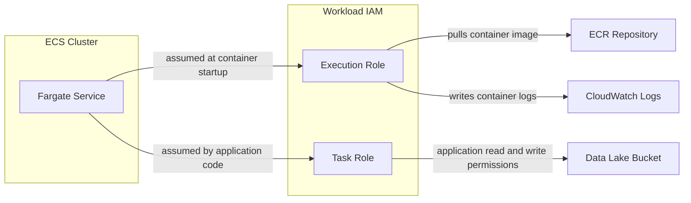

# Compute

```mermaid
flowchart LR
  subgraph cluster ["ECS Cluster"]
    service["Fargate Service"]
  end

  subgraph iam ["Workload IAM"]
    exec["Execution Role"]
    task["Task Role"]
  end

  ecr["ECR Repository"]
  logs["CloudWatch Logs"]
  datalake["Data Lake Bucket"]

  service -->|assumed at container startup| exec
  service -->|assumed by application code| task

  exec -->|pulls container image| ecr
  exec -->|writes container logs| logs

  task -->|application read and write permissions| datalake
```