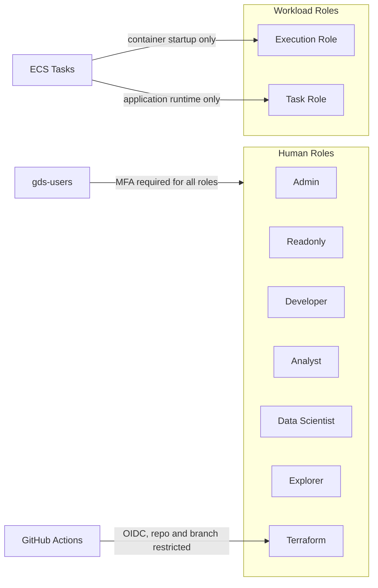

# IAM

```mermaid
flowchart LR
  gdsusers["gds-users"]
  gha["GitHub Actions"]
  ecstasks["ECS Tasks"]

  subgraph human ["Human Roles"]
    admin["Admin"]
    readonly["Readonly"]
    developer["Developer"]
    analyst["Analyst"]
    ds["Data Scientist"]
    explorer["Explorer"]
    tf["Terraform"]
  end

  subgraph workload ["Workload Roles"]
    exec["Execution Role"]
    task["Task Role"]
  end

  gdsusers -->|MFA required for all roles| human
  gha -->|OIDC, repo and branch restricted| tf

  ecstasks -->|container startup only| exec
  ecstasks -->|application runtime only| task
```