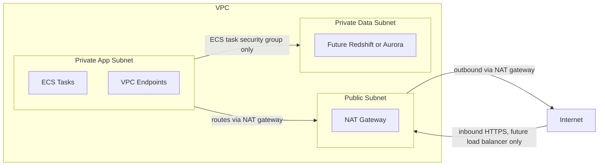

# Networking

```mermaid
flowchart LR
  internet["Internet"]

  subgraph vpc ["VPC"]
    subgraph public ["Public Subnet"]
      nat["NAT Gateway"]
    end
    subgraph app ["Private App Subnet"]
      tasks["ECS Tasks"]
      endpoints["VPC Endpoints"]
    end
    subgraph data ["Private Data Subnet"]
      future["Future Redshift or Aurora"]
    end
  end

  internet -->|inbound HTTPS, future load balancer only| public
  public -->|outbound via NAT gateway| internet
  app -->|routes via NAT gateway| public
  app -->|ECS task security group only| data
```