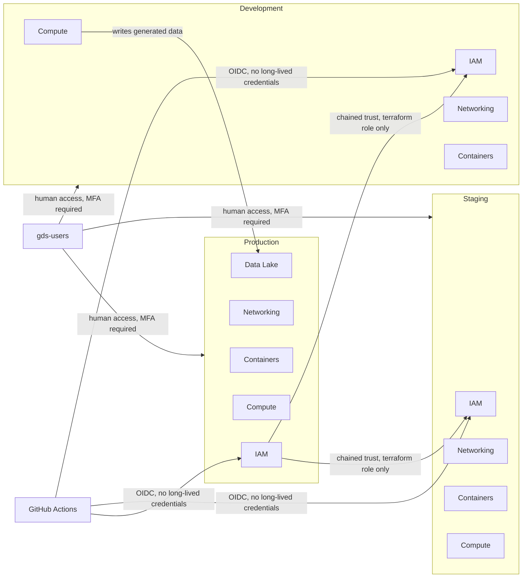
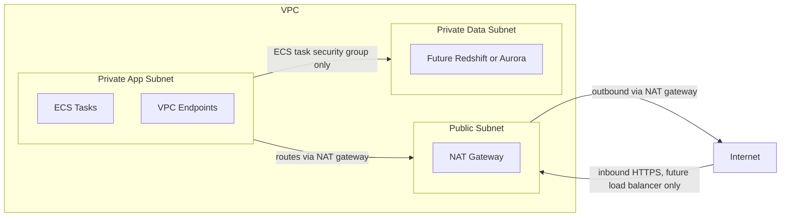
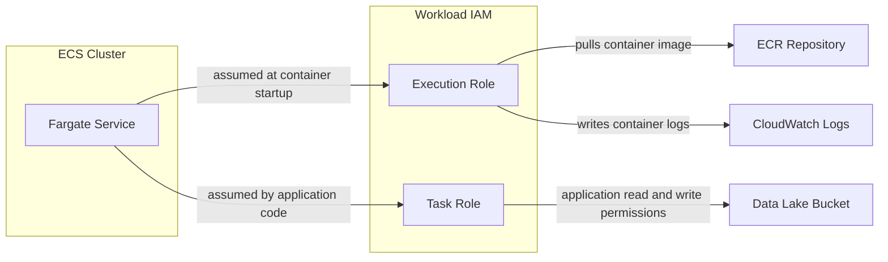

# Architecture diagrams

<!--date_created: tues-07-july-2026-->
<!--date_updated: weds-15-july-2026-->

**Description:** Plain text diagrams describing how the AIDR platform fits together, using Mermaid — a free, open-source diagram syntax that GitHub renders automatically. No paid plan, no API key, no separate rendering step. Open any `.md` file in this folder on GitHub and the diagram displays as a picture directly on the page. No need to open any special tool to understand the system. Each file explains itself in plain English first, then shows the diagram. 


- [System Overview](#system-overview-system-overviewmd)
- [Networking](#networking)


---

## System overview 

**[`system-overview.md`](../infrastructure/system-overview.md)**
*[back to top](#architecture-diagrams)*




Three separate AWS accounts — Development, Staging, and Production — each fully isolated from the others. People access the accounts through a central login system called `gds-users`, with a security code (MFA) required every time. Automated deployments use a separate, short-lived login method (OIDC) so no long-term passwords are stored anywhere. Production's automation is trusted to reach into Development and Staging when needed, but not the other way round.

## Networking 
*[back to top](#architecture-diagrams)*

**[`networking.md`](../infrastructure/networking.md)**





How each account's private network is laid out. Three zones:
- **Public** — only used for internet-facing pieces
- **Private App** — where the actual services run (containers, functions)
- **Private Data** — reserved for future databases, with no internet access at all

## Compute (`compute.md`)
*[back to top](#architecture-diagrams)*

**[`compute.md`](../infrastructure/compute.md)**




## Data lake (`data-lake.md`)
*[back to top](#architecture-diagrams)*


* **Storage:** A single Amazon S3 bucket for datasets and metadata, separated by logical prefixes.
* **Security:** All public access is explicitly blocked at the bucket level. Data is encrypted at rest using a customer-managed AWS KMS key.
* **Auditing:** Object-level API activity (read and write) is logged via an associated AWS CloudTrail trail directly to Amazon CloudWatch Logs.
* **Governance:** IAM roles and policies are provisioned to allow AWS Lake Formation to register and govern the S3 locations securely.

**Usage**

.. code-block:: terraform

```
module "data_lake" {
  source = "../../modules/data-lake"

  bucket_name           = "gds-aidr-data-lake-production"
  production_account_id = "<PRODUCTION_ACCOUNT_ID>"
  role_prefix           = "gds-aidr"

  reader_account_arns = [
    "arn:aws:iam::<DEVELOPMENT_ACCOUNT_ID>:root", # Development account root
    "arn:aws:iam::<STAGING_ACCOUNT_ID>2:root"  # Staging account root
  ]

  tags = {
    Environment = "Production"
    Owner       = "gds-aidr-team"
  }
}

```

**Inputs**

* `bucket_name` (string, required): Name of the data lake bucket.
* `production_account_id` (string, required): AWS account ID of the Production account that owns and administers the encryption key.
* `dataset_prefix` (string, optional): Prefix for dataset files. Default is `datasets/email/v1/`.
* `metadata_prefix` (string, optional): Prefix for metadata files. Default is `metadata/email/v1/`.
* `reader_account_arns` (list(string), optional): Account root ARNs permitted to read the lake cross-account, such as the Development and Staging account roots. Default is `[]`.
* `lakeformation_register_role_arn` (string, optional): ARN of an existing role Lake Formation uses to access the registered metadata location. Used when `create_lakeformation_register_role` is false.
* `create_lakeformation_register_role` (bool, optional): Whether this module creates the Lake Formation registration role itself. Default is `true`.
* `role_prefix` (string, optional): Prefix for IAM role names created by this module. Default is `gds-aidr`.
* `audit_log_retention_days` (number, optional): Retention period in days for object-level audit logs. Default is `365`.
* `tags` (map(string), optional): Tags applied to all resources created by the module.

**Outputs**

* `bucket_name`: Name of the data lake bucket. Consumed by the data backend repository.
* `bucket_arn`: ARN of the data lake bucket.
* `kms_key_arn`: ARN of the customer-managed AWS KMS encryption key.
* `dataset_prefix`: Prefix used for dataset files.
* `metadata_prefix`: Prefix used for metadata files.
* `audit_log_group`: Name of the Amazon CloudWatch log group containing object-level S3 audit logs.
* `lakeformation_register_role_arn`: ARN of the Lake Formation registration role.


---


## Cross-account IAM (`iam.md`)
*[back to top](#architecture-diagrams)*

[iam-cross-account-strategy](../infrastructure/iam-cross-account-strategy.md)

[AWS role scopes](../../role_scopes.pdf)


---

## Editing a diagram

Edit the Mermaid code block directly in the `.md` file, commit, push. GitHub re-renders it automatically — no build step, no external service, nothing to configure.

To preview locally before committing, either use the Mermaid Live Editor at https://mermaid.live (paste the code block in), or install the Mermaid extension in VS Code for an inline preview.