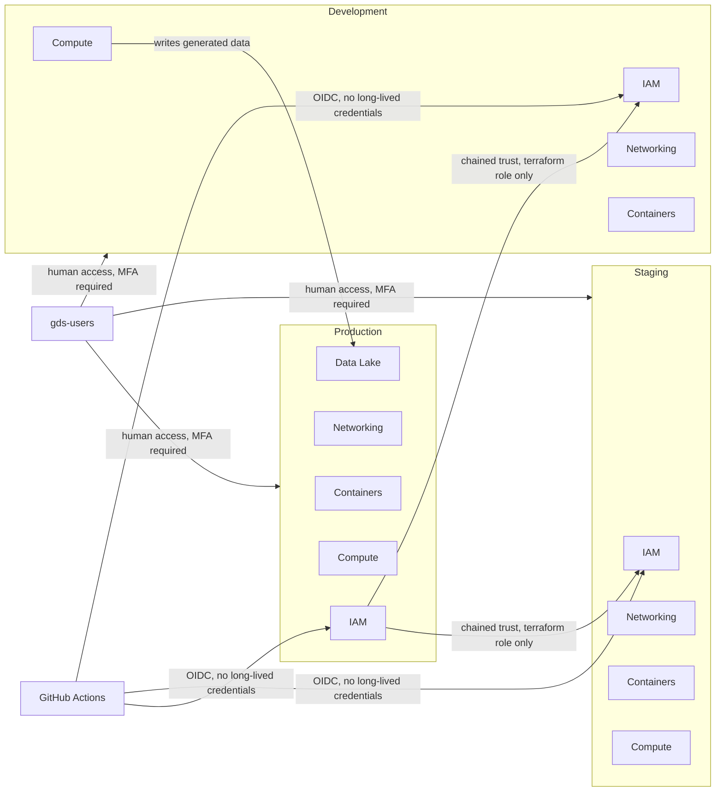

# System overview

```mermaid
flowchart LR
  gdsusers["gds-users"]
  gha["GitHub Actions"]

  subgraph development ["Development"]
    diam["IAM"]
    dnet["Networking"]
    dcon["Containers"]
    dcom["Compute"]
  end

  subgraph staging ["Staging"]
    siam["IAM"]
    snet["Networking"]
    scon["Containers"]
    scom["Compute"]
  end

  subgraph production ["Production"]
    piam["IAM"]
    pnet["Networking"]
    pcon["Containers"]
    pcom["Compute"]
    pdl["Data Lake"]
  end

  gdsusers -->|human access, MFA required| development
  gdsusers -->|human access, MFA required| staging
  gdsusers -->|human access, MFA required| production

  gha -->|OIDC, no long-lived credentials| diam
  gha -->|OIDC, no long-lived credentials| siam
  gha -->|OIDC, no long-lived credentials| piam

  piam -->|chained trust, terraform role only| diam
  piam -->|chained trust, terraform role only| siam

  dcom -->|writes generated data| pdl
```